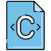

The repository consists of two directories:

[1.] The first directory contains exercises based on the book "The C Programming Language (2nd Edition)" by Brian W. Kernighan and Dennis M. Ritchie. These exercises are designed to deepen your understanding of C programming.(Ritchie-C)

[2.] Inside this directory, you'll find exercises based on the book "Sams Teach Yourself C in 24 Hours" by Tony Zhang and John Southmayd (2000). These exercises further develop your C programming skills within a structured learning framework.(Tony-C)

These folders provide a valuable resource for learning and practicing C programming, allowing you to work through exercises from two different perspectives.

